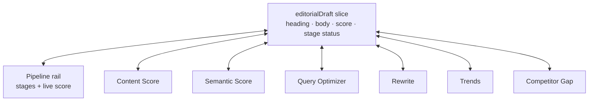

# feat: Editorial pipeline + Reader-vs-Machine council

## Summary

Connect the six standalone SEO tools into one guided editorial pipeline: a single persistent draft flows through every tool via a shared Redux slice, a pipeline rail shows the reporter which stage they're on and a citability score that climbs, and each tool renders its analysis as a two-voice **Reader vs. Machine** debate. The six oversized GPT-4 prompts are rewritten lean so a single call returns both voices affordably. Framed for a newsroom covering Indian startups.

---

## Problem Frame

Today the six tools are functional but disconnected (see origin: `docs/brainstorms/2026-07-12-editorial-pipeline-council-requirements.md`). The Redux store holds six isolated per-feature slices with no shared draft, and the cross-tool handoffs are inconsistent: Query Optimizer and Trends encode whole articles into URL query params, Semantic Score hands off via a Redux `setIncomingContent` dispatch (not URL params), Competitor Gap does a content-less `window.location` jump, and Content Score hands off to nothing. Worse, the NavBar renders feature links only on the home page (`isHome` in `app/NavBar.tsx`), so on a tool page there is no way to move to another tool at all. A reporter effectively copy-pastes one draft across six tabs.

Two code realities shape the plan. First, the prompts are enormous — `app/api/content-seo/route.ts` alone is a ~230-line prompt requesting a deeply nested JSON blob; doubling that into a council would be slow and expensive, so leaner prompts are a prerequisite, not polish. Second, Content Score's displayed score is mocked: the page calls `/api/content-seo` but then computes the number from character count in `evaluationComplete` (`store/slices/contentScoreSlice.ts`), so the score the user sees does not reflect the model.

---

## Requirements

Carried from the origin requirements doc; R-IDs are plan-local.

### Shared draft & pipeline spine

- R1. One persistent working draft is the shared object all six tools read from and write to, replacing the URL-param handoff. (origin R1)
- R2. A pipeline rail walks the reporter through stages in order: Discover (Trends / Competitor Gap) → Score (Content + Semantic) → Target (Query Optimizer) → Rewrite → re-score. (origin R2)
- R3. A single citability score is visible across the pipeline and moves as the draft improves; after Rewrite, re-scoring visibly changes the number. (origin R3)
- R4. Primary entry is pasting an existing draft; a lighter discovery-first entry (start from a Trend or gap, then draft) is also supported. (origin R4)
- R5. Each tool writes its applied changes back to the shared draft so later stages operate on the latest content. (origin R5)

### Two-voice council (Reader vs. Machine)

- R6. Every tool renders its output as two distinct voices: The Reader (human clarity, story, trust) and The Machine (what LLMs parse and cite). (origin R6)
- R7. Where the two voices disagree, the tool surfaces the tension and one reconciled action, not two unresolved lists. (origin R7)
- R8. The two voices are visually distinct and labeled consistently across all six tools. (origin R8)

### Prompt efficiency

- R9. The six GPT-4 prompts are rewritten leaner (fewer tokens per call) while preserving output quality, to keep the council affordable. (origin R9)
- R10. A tool's council response returns without making the tool feel slow. (origin R10)

### Newsroom framing

- R11. Copy, examples, and defaults are framed for a reporter at a newsroom covering Indian startups, without hard-coding India-specific entity data. (origin R11)

---

## Key Technical Decisions

- KTD1. **Shared draft as a new Redux slice.** Add one `editorialDraft` slice (heading, body, citability score, per-stage status) that all six tools read and write, replacing the URL-param handoff read in `app/rewrite-for-llm/page.tsx`. Keep it in the existing in-memory store; mirror to `localStorage` so a mid-demo refresh doesn't lose the draft. Rationale: the store already exists (`store/store.ts`), so this is the smallest change that makes the draft the source of truth (R1, R5). **SSR boundary:** the store is a module-level singleton imported by the `'use client'` `app/providers.tsx`, which Next.js still renders on the server; `localStorage` must never be read at store-init (it is `undefined` server-side and throws). Rehydrate only post-mount via a client-effect dispatch in Providers, guard every access with `typeof window !== 'undefined'`, and let the server render the empty initial state to avoid a hydration mismatch.

- KTD2. **Council is one lean prompt returning two voices, not two calls.** Each API route issues a single OpenAI call whose prompt asks for both a `reader` and a `machine` block in the JSON response. Rationale: still satisfies "two voices in every tool" (R6) while cutting cost. **Latency caveat:** OpenAI latency is dominated by output-token generation, not request count, so single-call is faster than two concurrent calls *only if* the combined two-voice output stays well below the sum of two independent responses — the lean shape (KTD3) is what makes that hold. U5 must measure single-call wall-clock against a two-parallel-call baseline on the reference route before rollout; if it loses, fall back to the deferred two concurrent calls (see Scope Boundaries). Genuinely-independent two-call mode can also be added to a single hero tool later if desired.

- KTD3. **Lean, flat response shape.** Collapse the nested per-route JSON schemas down to only the fields the UI renders, plus the two-voice blocks and a numeric sub-score. Rationale: the current schemas (e.g., `app/api/content-seo/route.ts`) request far more than the pages display; trimming them is what buys the second voice (R9, R10).

- KTD4. **Pipeline rail as a shared layout component.** Mount a persistent rail in `app/layout.tsx` (or a nested layout) that shows the ordered stages and the current citability score, giving cross-tool navigation on every page — which today's `isHome`-gated NavBar does not. Rationale: one component satisfies R2 and fixes the navigation dead-end at once.

- KTD5. **One real citability score, one authoritative writer.** Derive the shared score from the scoring routes' returned sub-score and store it on the draft, replacing Content Score's character-count mock in `store/slices/contentScoreSlice.ts`. Because two routes (Content + Semantic) can both produce a score, the slice — not each page — aggregates them deterministically into the single `citabilityScore` (avoid last-writer-wins). The shared 0–N scale lives as one constant/validator in `app/api/_shared/council.ts`; `score` is **required** for the scoring routes and validated against that scale before dispatch, so a drifted or missing score is rejected rather than silently corrupting the number. Rationale: R3 requires the displayed number to reflect the model, consistently.

- KTD6. **Keep the "climb" honest under model non-determinism.** `gpt-4-turbo-preview` at `temperature 0.2` with no seed can score the same body differently run-to-run, so a rewrite could re-score flat or lower on sampling noise — breaking AE2's central arc. Use `temperature: 0` for the scoring routes and clamp the displayed re-score so it never regresses below the prior score within a session. Rationale: R3/AE2 depend on the number moving up when the reporter improves the draft.

- KTD7. **Newsroom framing via prompt preamble + copy.** A shared preamble string ("You are assisting a reporter at a newsroom covering Indian startups…") is prepended to each route's prompt, and UI placeholder/example copy uses Indian-startup article examples. No entity lists or company databases. Rationale: delivers the framing (R11) at near-zero carrying cost, matching the brainstorm's "glue over depth" decision.

---

## High-Level Technical Design

**Shared draft as source of truth.** The `editorialDraft` slice is the hub; the six tools and the rail are spokes that read the current draft and write results/score back to it.

**Reporter journey** (primary paste-a-draft path; discovery-first enters before drafting). The rail itself encodes the five non-entry stages — Discover, Score, Target, Rewrite, Re-score; "Draft / Paste" is the entry action between Discover and Score, not a rail stage:

**Council request shape:** each route sends one call → response carries `{ score, reader: {...}, machine: {...}, reconciledAction }`. The dual-voice UI component renders `reader` and `machine` side by side and shows `reconciledAction` when they diverge.

---

## Implementation Units

Phased for demo-safety: after Phase 1 the pipeline is connected with a real, climbing score (already demoable); Phase 2 adds the council wow; Phase 3 adds theme polish. If time runs out, stop at a phase boundary and the demo still holds.

### Phase 1 — Pipeline spine

### U1. Shared editorial draft slice

- **Goal:** Add the `editorialDraft` Redux slice that becomes the single source of truth for the working article and its citability score.
- **Requirements:** R1, R5
- **Dependencies:** none
- **Files:** `store/slices/editorialDraftSlice.ts` (new), `store/store.ts` (register reducer), `store/slices/__tests__/editorialDraftSlice.test.ts` (new)
- **Approach:** State holds `heading`, `body`, `citabilityScore`, and a per-stage status map. Reducers: set heading/body, set score (with deterministic Content+Semantic aggregation and no-regress clamp per KTD5/KTD6), mark a stage complete, reset draft. Mirror to `localStorage` on change; rehydrate via a client-effect dispatch in `app/providers.tsx` **after mount** (never at store-init), guarded by `typeof window !== 'undefined'`, so the server renders the empty initial state (KTD1).
- **Patterns to follow:** Existing slice shape in `store/slices/contentScoreSlice.ts` (createSlice, typed PayloadAction, exported actions).
- **Test scenarios:**
  - Setting heading/body updates state and character counts.
  - Setting score from a stage updates `citabilityScore`; a later higher score overwrites it (Covers AE2).
  - Marking a stage complete flips only that stage's status.
  - Reset returns to initial and clears `localStorage`.
  - Aggregation: dispatching a Semantic score after a Content score yields the defined aggregate, and a lower re-score is clamped to not regress (Covers AE2).
  - Rehydration runs post-mount from a client effect; server/initial render uses the empty state (no hydration mismatch); absent/corrupt storage falls back to initial without throwing.

### U2. Pipeline rail component

- **Goal:** A persistent rail showing ordered stages and the live citability score, mounted on every page.
- **Requirements:** R2, R3
- **Dependencies:** U1
- **Files:** `components/PipelineRail.tsx` (new), `app/layout.tsx` (mount), `styles/PipelineRail.module.scss` (new), `components/__tests__/PipelineRail.test.tsx` (new)
- **Approach:** Read stage status and score from the `editorialDraft` slice. Render the five stages in order, each in one of three visual states from the slice's stage-status map — completed, current (active route), and upcoming (not reached); upcoming stages remain navigable (a reporter can jump ahead) but visually de-emphasized. Each stage links to its tool route (fixing the `isHome`-only navigation gap in `app/NavBar.tsx`). Show the citability score prominently; convey its movement with one reused mechanism (a brief count-up / delta on change) so a re-score is legible in a fast demo. **Empty state:** before any scoring run — including on the home route where the rail also mounts — show "not scored yet" rather than `0`, and render all stages as upcoming.
- **Patterns to follow:** Client component + `useSelector` usage as in the existing tool pages; SCSS module convention in `styles/`.
- **Test scenarios:**
  - Rail renders all five stages in the defined order.
  - Each stage renders in the correct state (completed / current / upcoming) from stage status.
  - Empty state: with no draft/score, the score area shows "not scored yet" and all stages read as upcoming (including on `/`).
  - Score displayed matches the slice value and animates/updates when it changes (Covers AE2).
  - Each stage exposes a working link to its tool route.
  - Test expectation covers rendering + selector wiring; visual styling is not asserted.

### U3. Wire all six tools to the shared draft

- **Goal:** Every tool reads the current draft on entry and writes its result/updated content back, replacing the URL-param and `window.location` handoffs.
- **Requirements:** R1, R4, R5
- **Dependencies:** U1
- **Files:** `app/content-seo-score/page.tsx`, `app/semantic-seo-score/page.tsx`, `app/query-optimizer/page.tsx`, `app/rewrite-for-llm/page.tsx`, `app/trend-alerts/page.tsx`, `app/competitor-gap-analysis/page.tsx`
- **Approach:** Each page initializes its input from `editorialDraft` instead of local/URL state. Rewrite drops the `URLSearchParams` handoff read (`app/rewrite-for-llm/page.tsx` `useEffect`) and reads the draft; when the reporter applies a rewrite, the updated body writes back to the draft. **Gotcha:** that same mount `useEffect` currently dispatches `reset()` when no `mode` param is present — it must be removed or reworked so it does not wipe a freshly seeded shared draft. Discovery-first (Trends / Competitor Gap) seeds the draft heading/angle when no draft exists yet.
- **Patterns to follow:** Existing `useDispatch`/`useSelector` per-page wiring; keep each page's own analysis slice for tool-specific result state.
- **Test scenarios:**
  - Entering any tool with a draft present pre-fills its input from the draft, not empty (Covers AE3).
  - Applying a Rewrite result writes the new body back to the draft; re-entering an earlier tool shows the updated body (Covers AE3).
  - Rewrite no longer depends on URL params: navigating to `/rewrite-for-llm` with no query string still loads the current draft.
  - Discovery-first: selecting a Trend/gap with an empty draft seeds heading/angle (Covers R4).

### U4. Real citability score

- **Goal:** Replace the mocked character-count score with a real number derived from the scoring routes, stored on the draft.
- **Requirements:** R3
- **Dependencies:** U1, U3, and the scoring-route sub-score shape from U5 (see note below) — that slice of U5 is a Phase 1 prerequisite, not deferrable to Phase 2.
- **Files:** `store/slices/contentScoreSlice.ts` (remove mock math), `app/content-seo-score/page.tsx`, `app/semantic-seo-score/page.tsx`, `app/api/content-seo/route.ts`, `app/api/semantic-seo/route.ts`
- **Approach:** The scoring routes return a single required numeric sub-score on the shared scale (KTD5). Pages dispatch it to the `editorialDraft` slice, which aggregates Content + Semantic deterministically into `citabilityScore` (KTD5) rather than each page overwriting it. Scoring routes run at `temperature: 0` and the displayed re-score is clamped to not regress (KTD6). Delete the `evaluationComplete` character-count calculation.
- **Note:** U4 needs only the scoring routes' `score` field, not the full two-voice council. Land that minimal response-shape change (part of U5) in Phase 1 so Phase 1 ships a real, climbing score standalone; the full Reader/Machine rollout stays in Phase 2.
- **Patterns to follow:** Existing `fetch('/api/content-seo')` flow in `app/content-seo-score/page.tsx`; keep the loading dispatch pattern.
- **Test scenarios:**
  - Score dispatched to the draft equals the API's returned score, not a character-count derivation.
  - After Rewrite changes the body, re-scoring produces a different draft score than before (Covers AE2).
  - API failure path: score is left unchanged and an error state shows, rather than silently writing a mock number.

### Phase 2 — Reader-vs-Machine council

### U5. Lean two-voice prompt + shared response shape

- **Goal:** One reference API route rewritten to a lean prompt returning both voices in a single call, establishing the pattern, then rolled to all six.
- **Requirements:** R6, R7, R9, R10
- **Dependencies:** none for the full council, but its scoring-route `score` field is a Phase 1 prerequisite for U4 — begin the response-shape work in parallel with Phase 1, not deferred to Phase 2.
- **Files:** `app/api/_shared/council.ts` (new — shared preamble + response typing), `app/api/content-seo/route.ts` (reference rewrite), then `app/api/semantic-seo/route.ts`, `app/api/query-optimizer/route.ts`, `app/api/rewrite-for-llm/route.ts`, `app/api/trend-alerts/route.ts`, `app/api/competitor-analysis/route.ts`
- **Approach:** Collapse each route's nested JSON schema to a flat shape: `{ score?, reader: { take, points }, machine: { take, points }, reconciledAction }`, where `score` is **required** for the two scoring routes and validated against the shared scale constant in `app/api/_shared/council.ts`. The prompt asks the model to answer once as The Reader and once as The Machine and to name one reconciled action when they conflict. Keep `response_format: json_object` and `model: gpt-4-turbo-preview`; scoring routes use `temperature: 0` (KTD6), others `0.2`. **Latency gate:** before rolling the single-call shape to all six routes, measure the reference route's wall-clock against a two-parallel-call baseline (KTD2); proceed with single-call only if it wins, else adopt the two concurrent calls.
- **Patterns to follow:** Existing route structure in `app/api/content-seo/route.ts` (OpenAI client init, POST handler, JSON parse, error catch).
- **Test scenarios:**
  - Response parses into the shared shape with both `reader` and `machine` populated.
  - When the two voices conflict, `reconciledAction` is present and non-empty (Covers AE1).
  - A scoring route with a missing or out-of-range `score` is rejected, not dispatched to the draft.
  - Prompt token count for the reference route is materially lower than the current prompt (record before/after).
  - Single-call wall-clock is recorded against a two-parallel-call baseline before rollout (Covers R10).
  - Malformed model JSON is caught and returns the existing 500 error shape, not an unhandled throw.

### U6. Dual-voice output UI

- **Goal:** A shared component that renders The Reader and The Machine side by side across all six tool result panels, with the reconciled action when they diverge.
- **Requirements:** R6, R7, R8
- **Dependencies:** U5
- **Files:** `components/CouncilVerdict.tsx` (new), `styles/CouncilVerdict.module.scss` (new), the six tool pages (swap result rendering to use it), `components/__tests__/CouncilVerdict.test.tsx` (new)
- **Approach:** Component takes `{ reader, machine, reconciledAction }` plus a status, and owns all four render states so the six tools inherit them identically: **loading** (show the existing `AISparkleLoader` while the council call is in flight), **error** (a retryable state when U5's route returns its 500), **empty** (a pre-run prompt state before first run), and **success** (two labeled panels + highlighted reconciled action when present). The two voices are distinguished by **label and icon, not color alone** (accessibility). **Responsive:** panels sit side by side above a defined breakpoint and stack vertically (Reader then Machine) below it, with the reconciled action full-width in both layouts.
- **Patterns to follow:** Existing result-panel markup in the tool pages; `AISparkleLoader` component convention in `components/`.
- **Test scenarios:**
  - Loading state renders the loader; error state renders a retry affordance; empty state renders the pre-run prompt.
  - Both voices render with their distinct labels and content (Covers R8).
  - Reconciled action shows only when provided; absent when the voices agree (Covers AE1).
  - Voice distinction survives without color (label/icon present).
  - Same component renders correctly given each tool's payload (Covers R8).
  - Test expectation covers structure/labeling/states; color styling is not asserted.

### Phase 3 — Newsroom framing

### U7. Newsroom framing

- **Goal:** Apply the Indian-startup newsroom lens through prompt preamble and UI copy, without hard-coded entity data.
- **Requirements:** R11
- **Dependencies:** U5
- **Files:** `app/api/_shared/council.ts` (preamble string), the six tool pages (placeholder/example copy)
- **Approach:** Prepend the shared newsroom preamble to each route's prompt. Update input placeholders and example text to Indian-startup article scenarios (funding, company profiles). No company lists or lookups.
- **Patterns to follow:** Existing placeholder/copy in the tool pages.
- **Test scenarios:** `Test expectation: none -- prompt-preamble and static copy change with no behavioral branch; covered indirectly by U5 shape tests.`

---

## Acceptance Examples

- AE1. Voices disagree — **Covers R7, U5, U6.** Given a draft where a change boosts citability but hurts readability, when a tool runs the council, then The Reader and The Machine show opposing takes and the tool presents one reconciled action.
- AE2. Score moves after rewrite — **Covers R3, R5, U4.** Given a scored draft the reporter rewrites, when they re-score, then the citability score reflects the new body and visibly changes upward from the pre-rewrite value (never regressing on sampling noise, per KTD6).
- AE3. Later stage sees latest content — **Covers R1, R5, U3.** Given the reporter applied a Rewrite suggestion, when they open any earlier or later tool, then it operates on the updated draft, not the originally pasted text.

---

## Scope Boundaries

### Deferred to Follow-Up Work

- Genuinely-independent two-call council mode for a single hero tool (KTD2 keeps single-call by default).
- The council latency/cost fallback (on-demand or cached second voice) if single-call still proves too slow live.
- Cleaning up the `rejectUnauthorized: false` httpAgent hack and broader API error handling in the routes.

### Deferred for later (from origin)

- Deep India domain data — company/sector recognition, comparing against Indian publications.
- Full inline "Grammarly-style" single-editor surface.
- Auth, multi-user, and backend persistence beyond the demo's `localStorage` mirror.
- New features beyond the existing six.

---

## Risks & Dependencies

- **Council latency (R10).** Single-call is not automatically faster — OpenAI latency scales with output tokens, so a single two-voice call can lose to two concurrent half-size calls. Mitigation: KTD3's flat shape plus the U5 measurement gate against a two-parallel baseline before rollout; two concurrent calls remain the reachable fallback (Scope Boundaries).
- **Score climb integrity (R3, AE2).** The score must stay on a stable scale *and* move upward after a genuine improvement, despite model non-determinism at nonzero temperature. Mitigation: shared scale constant in `app/api/_shared/council.ts`, `temperature: 0` on scoring routes, deterministic aggregation, and a no-regress display clamp (KTD5, KTD6).
- **No test runner today (prerequisite).** `package.json` has no test script and the repo has no jest/vitest config or existing test files, yet every unit lists `.test` files. Standing up a test runner (e.g., vitest + React Testing Library) is a prerequisite before any listed scenario can run; under hackathon time pressure, treat the test scenarios as the intended coverage and set up the runner only if time allows.
- **OpenAI dependency.** All six routes depend on `OPENAI_API_KEY` and `gpt-4-turbo-preview` (existing). No new provider introduced.
- **localStorage persistence.** In-memory + `localStorage` mirror is demo-grade only; not a durable store (accepted per Scope Boundaries).

---

## Sources & Research

- Origin requirements: `docs/brainstorms/2026-07-12-editorial-pipeline-council-requirements.md`.
- Current handoff mechanism: `app/rewrite-for-llm/page.tsx` (`URLSearchParams` read), `app/query-optimizer/page.tsx`, `app/trend-alerts/page.tsx`, `app/semantic-seo-score/page.tsx`, `app/competitor-gap-analysis/page.tsx` (`window.location.href`).
- Mocked score: `store/slices/contentScoreSlice.ts` (`evaluationComplete` character-count math) vs. real `app/api/content-seo/route.ts`.
- Navigation gap: `app/NavBar.tsx` (`isHome`-gated links).
- Prompt size baseline: `app/api/content-seo/route.ts` (~230-line prompt, nested JSON schema).
- Store wiring: `store/store.ts`, `app/providers.tsx` (no persistence library today).
